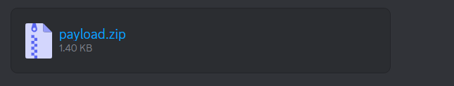
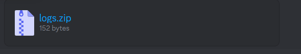

# Discord Keylogger Bot

**Discord Keylogger Bot** is a Discord bot that allows you to create a keylogger.

## Before Usage

**Don't forget to add your Discord bot token and webhook.**

## Usage

To use the bot, follow these steps:

1. Type **!keylogger** in your Discord server.

2. You will receive the keylogger file.

## After Running on Target

You will receive the log file every day at 11.30 a.m.

